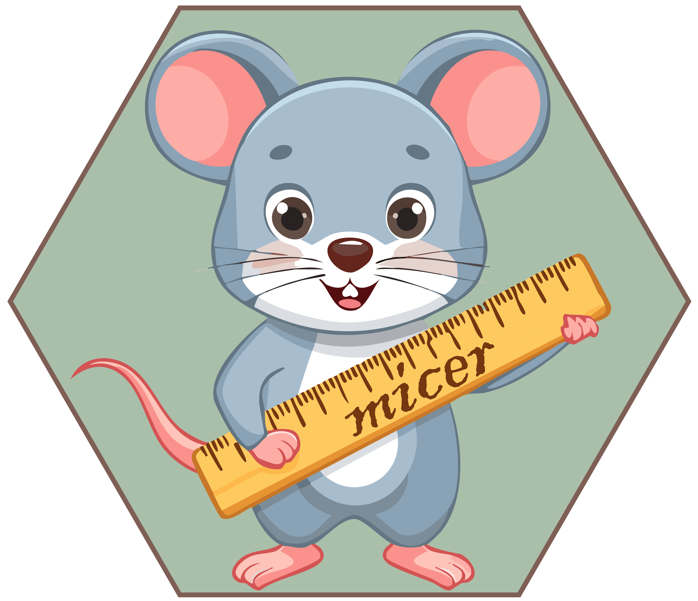

<!-- README.md is generated from README.Rmd. Please edit that file -->

# micer 

## Installation

You can install the development version of micer from [GitHub](https://github.com/) with:

```r
# install.packages("devtools")
devtools::install_github("maxwell-geospatial/micer")
```

## Intro to micer

The goal of this simple R package is to allow for the calculation of map image classification efficacy (MICE) and associated metrics. MICE was originally proposed in the following paper:

Shao, G., Tang, L. and Zhang, H., 2021. Introducing image classification efficacies. *IEEE Access*, 9, pp.134809-134816. [10.1109/ACCESS.2021.3116526](https://ieeexplore.ieee.org/document/9551959).

It was further explored in the following paper:

Tang, L., Shao, J., Pang, S., Wang, Y., Maxwell, A., Hu, X., Gao, Z., Lan, T. and Shao, G., 2024. Bolstering Performance Evaluation of Image Segmentation Models with Efficacy Metrics in the Absence of a Gold Standard. *IEEE Transactions on Geoscience and Remote Sensing*. [10.1109/TGRS.2024.3446950](https://ieeexplore.ieee.org/document/10643219)

MICE adjusts the accuracy rate relative to a random classification baseline. Only the proportions from the reference labels are considered, as opposed to the proportions from the reference and predictions, as is the case for the Kappa statistic. This package specifically calculates MICE and adjusted versions of class-level user's (i.e., precision) and producer's (i.e., recall) accuracies and F1-scores. Class-level metrics are aggregated using macro-averaging in which each class contributes equally. Functions are also made available to estimate confidence intervals using bootstrapping and to statistically compare two classification results. See the included vignette for example implementations. 
